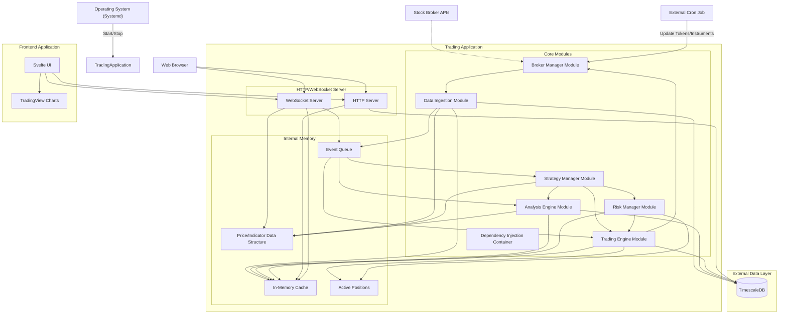

# Main Application Architecture

## Realtime Analysis and Trading Application

### Document Information
- **Version**: 1.2
- **Date**: July 21, 2025
- **Author**: Technical Architect
- **Status**: Updated Draft

---

## Executive Summary

This document defines the main application architecture for a high-performance, real-time analysis and trading application designed for individual intraday traders. The system prioritizes sub-300ms execution latency, supports up to 500 instruments and 30-40 concurrent strategies, and provides comprehensive risk management capabilities.

### Key Architectural Decisions

- **Monolithic Architecture**: Monolithic Modular Components with clear separation of concerns, executing as a single application.
- **Continuous Operation**: Designed for 24/7 runtime on a server, managed by `systemd` with external cron for scheduled tasks.
- **Event-Driven Processing**: Asynchronous message processing for optimal performance.
- **In-Memory Computing**: Critical data cached for sub-300ms response times, with specialized data structures for real-time price and indicator values.
- **Broker-Agnostic Design**: Generic interface supporting multiple broker integrations, with separate classes for broker interaction and data transformation.
- **Time-Series Optimized Storage**: PostgreSQL with TimescaleDB for efficient data handling.
- **Dependency Injection**: Utilizing InversifyJS for modularity and testability.
- **Operational Isolation**: Separate executable entry points for live trading/paper trading and backtesting.

## High-Level System Design



### Core Design Principles

1. **Performance First**: Every component optimized for the 300ms latency requirement.
2. **Fault Tolerance**: Graceful degradation, automatic recovery, and defined crash recovery mechanisms.
3. **Modularity**: Loosely coupled components with clear interfaces, facilitated by Dependency Injection.
4. **Observability**: Comprehensive logging, metrics, and monitoring.
5. **Abstraction**: Clear interfaces for external services (e.g., brokers) to minimize impact of changes.

## Application Lifecycle

The application is designed for continuous operation and follows a specific lifecycle from startup to graceful shutdown.

### Startup Flow

1. **Application Start**: The application executable (e.g., `bun run start:live`) is launched, typically by `systemd` at a scheduled time.
2. **Instance Initialization & Dependency Injection**: Core services and components are instantiated. `InversifyJS` container is initialized, and instances are bound and resolved, ensuring all dependencies are met.
3. **Startup Checks**:
   * **Database Connection**: Verify connectivity and schema integrity with PostgreSQL/TimescaleDB.
   * **Broker Connection**: Establish initial connection(s) to the configured broker(s) via the Broker Manager.
4. **Instrument Processing**:
   * Instruments are filtered and validated based on application-specific criteria.
   * Filtered instruments are sent to the Broker Manager for data subscription, ensuring the broker accepts subscriptions for these instruments.
5. **Data Collection**: The Data Ingestion Module begins collecting real-time tick data, open interest and order book information from the broker(s).
6. **Data Aggregation**: Raw data is sent to the Real-time Data Aggregator (within the Analysis Engine).
   * The Aggregator processes raw ticks into various OHLC timeframes (e.g., 1-second, 5-minute).
   * It updates the in-memory `Price/Indicator Data Structure`.
7. **Strategy Subscription & Execution**:
   * The Real-time Data Aggregator pushes updated OHLC data and indicator values to all subscribed strategies via the Strategy Manager.
   * Strategies analyze the incoming data and, based on their logic, generate trading signals.
   * If a signal warrants a trade, the Strategy requests an order execution from the Trading Engine.
8. **Order Execution**: The Trading Engine processes the order request, applies risk management rules via the Risk Manager, and sends the order to the Broker Manager for execution with the external broker.
9. **Order Confirmation & Position Update**: Broker confirms order execution (or rejection). The Trading Engine updates its internal position state, records the order history, and notifies relevant modules.

### Component-Specific Lifecycle Methods

Individual services and modules within the application expose explicit lifecycle methods (e.g., `start()`, `stop()`, `initialize()`, `destroy()`). These methods are called by the main application bootstrap process and the `Dependency Injection Container` to manage their internal resources, establish connections, and perform clean-up operations during graceful shutdown.

### Graceful Shutdown

The application handles standard operating system signals (`SIGINT`, `SIGTERM`) to trigger a graceful shutdown process. This process includes:

* Calling `stop()`/`destroy()` methods on all active components (e.g., disconnecting from brokers, flushing pending data to DB, saving strategy states).
* Closing database connections and freeing system resources.
* Ensuring no open trades are left in an inconsistent state (handled by the Crash Recovery Strategy).

## Performance Architecture

### Sub-300ms Latency Requirements

#### In-Memory Data Management

- **Native JavaScript Maps**: Critical market data cached with sub-microsecond access time.
- **In-Memory Positions**: Active positions stored in optimized data structures.
- **Bun Connection Pooling**: Pre-established database connections using Bun's native pooling.
- **Prepared Statements**: Pre-compiled SQL queries for faster execution.
- **Zero-Copy Buffers**: Efficient memory management for high-frequency data.

#### Asynchronous Processing Pipeline

```typescript
// High-performance monolithic data processing pipeline
class DataProcessingPipeline {
  private tickBuffer: Map<string, TickData[]> = new Map();
  private priceCache: Map<string, number> = new Map();
  private eventEmitter = new EventTarget();

  async processTick(tick: TickData): Promise<void> {
    // 1. Buffer tick data in native Map (< 0.1ms)
    const instrument = tick.instrumentId;
    const buffer = this.tickBuffer.get(instrument) ?? [];
    buffer.push(tick);
    if (buffer.length > 1000) buffer.shift(); // Keep last 1000 ticks
    this.tickBuffer.set(instrument, buffer);
    
    // 2. Update in-memory price cache (< 0.5ms)
    this.priceCache.set(instrument, tick.price);
    
    // 3. Emit events for immediate processing (< 1ms)
    this.eventEmitter.dispatchEvent(new CustomEvent('tick', {
      detail: tick
    }));
    
    // 4. Check trading signals using cached data (< 5ms)
    const signals = await this.checkTradingSignals(tick);
    
    // 5. Execute trades synchronously for minimal latency (< 20ms)
    for (const signal of signals) {
      await this.executeTrade(signal);
    }
  }

  private async checkTradingSignals(tick: TickData): Promise<TradingSignal[]> {
    // Direct memory access to historical data for sub-ms analysis
    const historicalPrices = this.tickBuffer.get(tick.instrumentId) || [];
    // ... signal processing logic
    return [];
  }
}
```

### Vertical Scaling Architecture

#### Single-Application Scaling Strategy

```typescript
// Monolithic application configuration for maximum performance
const applicationConfig = {
  maxInstruments: 500,
  maxConcurrentStrategies: 40,
  dataIngestionRate: 10000, // ticks per second
  memoryAllocation: {
    tickDataBuffer: '2GB',
    analysisCache: '1GB',
    positionsCache: '512MB',
    strategiesMemory: '1GB'
  },
};
```

#### Memory-Optimized Load Distribution

- **Instrument Partitioning**: Data structures partitioned by instrument for cache locality.
- **Strategy Management**: Strategies run within the main application process, managed by the Strategy Manager. Concurrency is handled via Bun's event loop (`async/await`) for I/O-bound operations.
- **Priority Processing**: Critical orders bypass queue for immediate execution.
- **Memory Pools**: Pre-allocated object pools to minimize garbage collection.

## Robustness & Fault Tolerance

### WebSocket Liveness Checks & Auto-Reconnection

* **Liveness Checks**: Implement regular heartbeat mechanisms or ping-pong frames over WebSocket connections to broker data feeds. If a response is not received within a defined timeout, the connection is considered stale.
* **Auto-Reconnection**: Upon detecting a disconnected or stale WebSocket, the system will automatically attempt to re-establish the connection. This includes:
  * Exponential backoff strategy for retries to avoid overwhelming broker APIs.
  * Logging of connection attempts and failures for monitoring.
  * Prioritization of critical data feeds.

### Crash Recovery Strategy for Trading Positions

In the event of an unexpected application crash or restart, a defined recovery process ensures minimal impact on trading operations and data integrity:

* **Persistent Position State**: All open trading positions are persistently stored in the `positions` table in TimescaleDB. This includes `strategy_id`, `instrument_id`, `quantity`, `average_entry_price`, `stop_loss_price`, and `status`.
* **Startup Reconciliation**:
  * On application restart, the **Trading Engine** and **Risk Manager** will query the database to retrieve all `OPEN` positions associated with currently enabled strategies.
  * For each re-loaded position, the system will:
    * Re-establish internal monitoring (e.g., stop-loss triggers).
    * Reconcile the internal position state with the actual position held at the broker (via Broker Manager API calls). This step is crucial to detect any discrepancies that might have occurred during the crash.
    * Re-subscribe to relevant market data streams for these instruments to ensure real-time updates for continued monitoring and execution.
* **Order Reconciliation**: Pending orders (if any) at the time of crash will also be queried from the database and their status verified with the broker to prevent duplicate orders or missed fills.

---

## Cross-References

- **Components**: See individual component files for detailed specifications
- **Technology Stack**: See [`tech-stack.md`](tech-stack.md) for detailed technology choices
- **Database Design**: See [`database-schema.md`](database-schema.md) for data model
- **API Specifications**: See [`api-websocket-specs.md`](api-websocket-specs.md) for API design
- **Monitoring**: See [`monitoring-observability.md`](monitoring-observability.md) for operational monitoring

---

*This document provides the foundational architecture that enables all other system components to work together efficiently and reliably.*