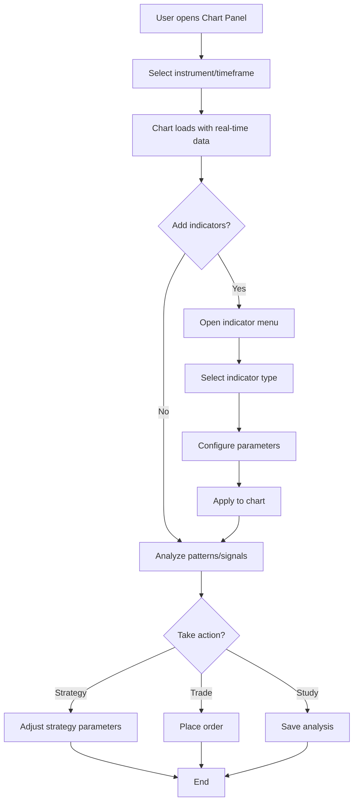
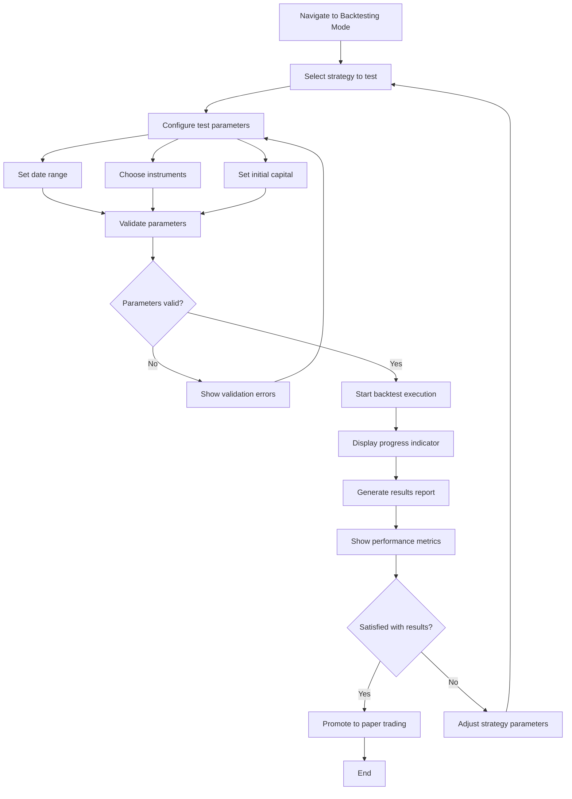
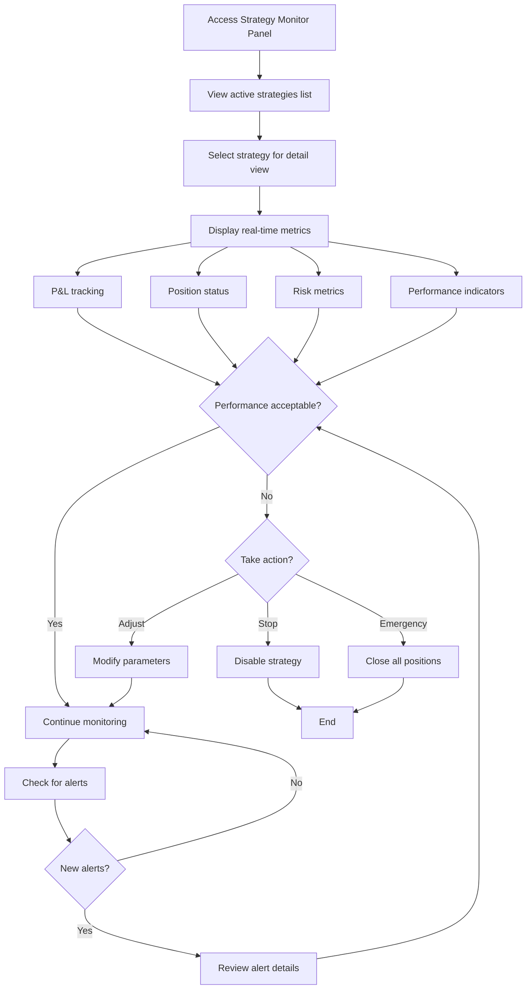

# Realtime Analysis and Trading Application UI/UX Specification

## Introduction

This document defines the user experience goals, information architecture, user flows, and visual design specifications for Realtime Analysis and Trading Application's user interface. It serves as the foundation for visual design and frontend development, ensuring a cohesive and user-centered experience.

### Overall UX Goals & Principles

#### Target User Personas

**Primary User: Individual Intraday Trader**
- Technical professionals with trading experience
- Focused on 1-15 minute trade durations
- Need real-time data analysis and automated strategy execution
- Require low-latency performance (sub-300ms)
- Comfortable with complex interfaces if they provide value

#### Usability Goals

- **Speed of execution**: Critical actions (order placement, position monitoring) must be accessible within 1-2 clicks
- **Real-time clarity**: Users can assess market conditions and strategy performance at a glance
- **Error prevention**: Clear visual distinction between live trading and paper trading modes
- **Risk awareness**: Position sizes, stop-losses, and risk metrics are always visible
- **Performance transparency**: System latency and data feed status are clearly indicated

#### Design Principles

1. **Performance First** - Every UI element optimized for the 300ms execution requirement
2. **Information Hierarchy** - Critical trading data takes visual precedence over secondary features
3. **Mode Clarity** - Live vs Paper vs Backtest modes are unmistakably distinct
4. **Risk Prominence** - Risk management controls are always visible and accessible
5. **Real-time Responsiveness** - UI updates reflect market changes without overwhelming the user

### Change Log

| Date | Version | Description | Author |
|------|---------|-------------|--------|
| 2025-01-19 | 1.0 | Initial UI/UX specification | Sally (UX Expert) |

---

## Information Architecture (IA)

### Site Map / Screen Inventory

```mermaid
graph TD
    A[Main Workbench] --> B[Chart Panel]
    A --> C[Order Flow Panel]
    A --> D[Strategy Monitor Panel]
    A --> E[Trade List Panel]
    A --> F[Risk Controls Panel]
    A --> G[Market Data Panel]
    
    H[Navigation Bar] --> H1[Live Trading Mode]
    H --> H2[Paper Trading Mode]
    H --> H3[Backtesting Mode]
    H --> H4[Strategy Management]
    H --> H5[Settings & Account]
    
    B --> B1[TradingView Charts]
    B --> B2[Technical Indicators]
    B --> B3[Drawing Tools]
    
    C --> C1[Level 6 Data]
    C --> C2[Order Book Depth]
    C --> C3[Volume Analysis]
    
    D --> D1[Active Strategies List]
    D --> D2[Strategy Performance]
    D --> D3[Strategy Controls]
    
    E --> E1[Open Positions]
    E --> E2[Order History]
    E --> E3[P&L Summary]
    
    F --> F1[Position Size Monitor]
    F --> F2[Stop Loss Controls]
    F --> F3[Risk Metrics Dashboard]
```



### Navigation Structure

**Primary Navigation:** Top sidebar with mode switcher (Live/Paper/Backtest) and main sections (Strategies, Settings). Mode switching is the most critical navigation element as it determines the operational context.

**Secondary Navigation:** Panel management toolbar allowing users to show/hide, resize, and rearrange workbench panels. Each panel has its own internal navigation for specific features.

**Panel Management:**
- Drag-and-drop panel arrangement
- Panel docking and undocking
- Saved workspace layouts
- Quick panel toggles in toolbar

## User Flows

### Chart Analysis with Indicators

**User Goal:** Analyze market data using technical indicators to inform trading decisions

**Entry Points:**
- Main workbench Chart Panel
- Strategy development workflow
- Post-trade analysis review

**Success Criteria:** User can apply indicators, identify patterns, and make informed trading decisions within 30 seconds

#### Flow Diagram



#### Edge Cases & Error Handling:
- Data feed interruption: Display clear warning, show last known data timestamp
- Indicator calculation errors: Show error message, suggest parameter adjustments
- Chart performance issues: Implement data throttling, reduce update frequency
- Invalid timeframe selection: Auto-correct to nearest valid timeframe

**Notes:** Chart performance is critical - implement smart rendering for high-frequency updates

---

### Backtesting a Strategy

**User Goal:** Validate strategy performance using historical data before live deployment

**Entry Points:**
- Strategy management interface
- Strategy development workflow
- Performance review process

**Success Criteria:** User can configure, execute, and analyze backtest results within 2 minutes

#### Flow Diagram



#### Edge Cases & Error Handling:
- Insufficient historical data: Suggest alternative date ranges, show data availability
- Strategy execution errors: Provide detailed error logs, suggest fixes
- Long execution times: Show progress bar, allow cancellation with partial results
- Memory/performance limits: Implement chunked processing, warn about large datasets

**Notes:** Provide rich performance analytics including profit factor, win rate, drawdown analysis

---

### Monitoring Real-time Performance

**User Goal:** Track active strategy performance and market conditions in real-time

**Entry Points:**
- Live trading dashboard
- Strategy activation
- Alert notifications

**Success Criteria:** User can assess strategy health and take corrective action within 5 seconds

#### Flow Diagram



#### Edge Cases & Error Handling:
- Strategy malfunction: Auto-disable with notification, preserve position data
- Risk limit breach: Immediate visual alerts, automated position reduction
- Data feed issues: Clear status indicators, fallback data sources
- Performance degradation: System load warnings, suggest optimization

**Notes:** Implement smart alerting to avoid notification fatigue while ensuring critical issues are highlighted

---

### Strategy Parameter Adjustment

**User Goal:** Fine-tune strategy settings based on market conditions or performance feedback

**Entry Points:**
- Strategy performance review
- Real-time monitoring alerts
- Scheduled optimization routine

**Success Criteria:** User can safely adjust parameters and validate changes within 1 minute

#### Flow Diagram

```mermaid
graph TD
    A[Access Strategy Settings] --> B[View current parameters]
    B --> C[Identify parameter to adjust]
    C --> D[Modify parameter value]
    D --> E[Preview impact simulation]
    E --> F{Impact acceptable?}
    F -->|No| G[Revert or try different value]
    F -->|Yes| H{Strategy currently active?}
    G --> D
    H -->|Yes| I[Choose update method]
    H -->|No| K[Apply changes]
    I --> I1[Hot update (if safe)]
    I --> I2[Schedule for next cycle]
    I --> I3[Stop and restart]
    I1 --> J[Validate successful update]
    I2 --> J
    I3 --> J
    J --> L{Update successful?}
    L -->|Yes| M[Monitor for immediate impact]
    L -->|No| N[Rollback to previous settings]
    K --> M
    M --> O[End]
    N --> O
```

#### Edge Cases & Error Handling:
- Invalid parameter values: Real-time validation with helpful error messages
- Active position conflicts: Warn about impact on open trades, suggest timing
- System constraints: Show parameter limits, explain technical constraints
- Rollback failures: Maintain parameter history, emergency safe mode

**Notes:** Implement parameter validation and impact simulation to prevent harmful changes

## Wireframes & Mockups

### Design Files
**Primary Design Files:** To be created in Figma - [Trading App Workbench Designs](placeholder-link)

### Key Screen Layouts

#### Main Trading Workbench

**Purpose:** Primary interface for live trading operations with customizable panel layout

**Key Elements:**
- Central chart area with TradingView Lightweight Charts integration
- Dockable side panels for order flow, strategy monitor, and risk controls
- Top toolbar with mode switcher and critical status indicators
- Bottom status bar showing system performance and connection status

**Interaction Notes:** All panels support drag-and-drop repositioning, resizing, and show/hide functionality. Quick keyboard shortcuts for panel management.

**Design File Reference:** [Figma Frame: Main Workbench Layout](placeholder-link)

#### Strategy Management Interface

**Purpose:** Configure, monitor, and control automated trading strategies

**Key Elements:**
- Strategy list with status indicators (active/inactive/error states)
- Parameter configuration forms with real-time validation
- Performance metrics dashboard with charts
- Risk controls and position monitoring

**Interaction Notes:** Inline editing for parameters, confirmation dialogs for critical actions, real-time status updates

**Design File Reference:** [Figma Frame: Strategy Management](placeholder-link)

#### Backtesting Results View

**Purpose:** Display comprehensive backtest analysis and performance metrics

**Key Elements:**
- Equity curve visualization
- Trade list with detailed metrics
- Performance statistics summary
- Comparison tools for multiple test runs

**Interaction Notes:** Interactive charts with zoom/pan, sortable tables, exportable reports

**Design File Reference:** [Figma Frame: Backtest Results](placeholder-link)

---

## Component Library / Design System

### Design System Approach
**Hybrid System:** TradingView Lightweight Charts visual language for all charting components, combined with Tailwind CSS utility framework for general interface elements. This ensures chart consistency with industry standards while maintaining development efficiency.

### Core Components

#### Trading Chart Component

**Purpose:** Primary data visualization using TradingView Lightweight Charts with custom overlays

**Variants:**
- Candlestick charts (primary)
- Line charts (simplified view)
- Volume charts (supporting data)

**States:** Loading, Active (real-time updates), Historical (static), Error (data unavailable)

**Usage Guidelines:** Always include loading states, implement smart update batching for performance, provide fallback for chart rendering errors

#### Data Status Indicator

**Purpose:** Show real-time status of market data feeds and system performance

**Variants:**
- Connection status (connected/disconnected/reconnecting)
- Latency indicator (green <100ms, yellow 100-250ms, red >250ms)
- Data freshness (last update timestamp)

**States:** Normal, Warning, Critical, Unknown

**Usage Guidelines:** Use consistent color coding across all status indicators, provide tooltips with detailed information

#### Risk Control Panel

**Purpose:** Display and control position sizes, stop-losses, and risk metrics

**Variants:**
- Compact view (essential metrics only)
- Detailed view (full risk breakdown)
- Alert mode (when limits are breached)

**States:** Safe, Warning, Critical, Emergency Stop

**Usage Guidelines:** Critical information must be visible at all times, use progressive disclosure for detailed metrics

#### Strategy Card Component

**Purpose:** Display strategy status, performance, and controls in a compact format

**Variants:**
- List view (minimal information)
- Card view (detailed metrics)
- Expanded view (full controls)

**States:** Active, Inactive, Error, Paused

**Usage Guidelines:** Consistent status indicators, clear enable/disable controls, performance metrics updated in real-time

#### Mode Switcher

**Purpose:** Toggle between Live Trading, Paper Trading, and Backtesting modes

**Variants:**
- Horizontal tabs (desktop)
- Dropdown menu (mobile/compact)

**States:** Active mode, Inactive modes, Transitioning

**Usage Guidelines:** Clear visual distinction between modes, confirmation required for Live Trading mode, persistent mode indicator

#### Action Button System

**Purpose:** Standardized buttons for trading actions with appropriate urgency indicators

**Variants:**
- Primary (buy/sell orders)
- Secondary (strategy controls)
- Danger (emergency stop, close positions)
- Ghost (cancel, settings)

**States:** Default, Hover, Active, Loading, Disabled

**Usage Guidelines:** Danger actions require confirmation, loading states for async operations, consistent sizing and spacing

## Branding & Style Guide

### Visual Identity
**Brand Guidelines:** Trading application follows a professional, data-focused aesthetic prioritizing clarity and performance over decorative elements

### Color Palette

| Color Type | Hex Code | Usage |
|------------|----------|--------|
| Primary | #1E293B | Main interface backgrounds, primary text |
| Secondary | #475569 | Secondary text, inactive elements |
| Accent | #3B82F6 | Interactive elements, links, highlights |
| Success | #10B981 | Profitable trades, positive indicators, buy signals |
| Warning | #F59E0B | Caution alerts, moderate risk indicators |
| Error | #EF4444 | Losses, high risk, sell signals, stop-losses |
| Neutral | #64748B, #E2E8F0, #F8FAFC | Text hierarchy, borders, backgrounds |

### Typography

#### Font Families
- **Primary:** Inter (clean, readable interface font)
- **Secondary:** JetBrains Mono (monospace for numerical data)
- **Monospace:** Fira Code (code editing, technical values)

#### Type Scale

| Element | Size | Weight | Line Height |
|---------|------|--------|-------------|
| H1 | 24px | 600 | 1.2 |
| H2 | 20px | 600 | 1.3 |
| H3 | 18px | 500 | 1.4 |
| Body | 14px | 400 | 1.5 |
| Small | 12px | 400 | 1.4 |

### Iconography
**Icon Library:** Heroicons v2 (outline and solid variants) for interface elements, custom trading-specific icons for charts and financial indicators

**Usage Guidelines:** Consistent 16px and 20px sizes, maintain visual weight balance, use outline icons for inactive states and solid for active states

### Spacing & Layout
**Grid System:** 8px base unit system for consistent spacing and alignment

**Spacing Scale:** 4px, 8px, 12px, 16px, 24px, 32px, 48px, 64px (multiples of 4px for precision)

---

## Accessibility Requirements

### Compliance Target
**Standard:** WCAG 2.1 AA compliance with enhanced considerations for high-stress trading environments

### Key Requirements

**Visual:**
- Color contrast ratios: 4.5:1 minimum for normal text, 3:1 for large text
- Focus indicators: 2px solid outline with high contrast colors
- Text sizing: Minimum 14px for interface text, scalable up to 200% without loss of functionality

**Interaction:**
- Keyboard navigation: Full keyboard access for all trading functions, logical tab order
- Screen reader support: Proper ARIA labels for dynamic content, live regions for price updates
- Touch targets: Minimum 44px for touch interfaces, adequate spacing between interactive elements

**Content:**
- Alternative text: Descriptive alt text for chart images, meaningful labels for data visualizations
- Heading structure: Logical heading hierarchy for screen reader navigation
- Form labels: Clear, descriptive labels for all form controls and trading inputs

### Testing Strategy
Regular accessibility audits using automated tools (axe-core) combined with manual testing and screen reader validation, with particular attention to real-time data updates and trading workflow accessibility

---

## Responsiveness Strategy

### Breakpoints

| Breakpoint | Min Width | Max Width | Target Devices |
|------------|-----------|-----------|----------------|
| Mobile | 320px | 767px | Phones (monitoring only) |
| Tablet | 768px | 1023px | Tablets (basic trading) |
| Desktop | 1024px | 1439px | Standard monitors |
| Wide | 1440px | - | Multiple monitors, ultrawide displays |

### Adaptation Patterns

**Layout Changes:** Mobile uses single-panel stack view, tablet allows 2-panel side-by-side, desktop enables full workbench layout with customizable panels

**Navigation Changes:** Mobile uses bottom tab bar, tablet/desktop use sidebar navigation, wide screens can accommodate persistent panels

**Content Priority:** Mobile shows only critical data (positions, alerts), tablet adds basic charts, desktop provides full feature set

**Interaction Changes:** Mobile uses swipe gestures for panel switching, touch-optimized controls, larger tap targets for critical actions

---

## Animation & Micro-interactions

### Motion Principles
**Performance-first animations:** All animations must not interfere with real-time data updates, use CSS transforms and opacity for optimal performance, respect user's reduced motion preferences

### Key Animations
- **Panel transitions:** Smooth slide-in/out animations (300ms, ease-out)
- **Data updates:** Subtle flash animations for price changes (200ms, ease-in-out)
- **Status changes:** Color transitions for connection status (150ms, linear)
- **Loading states:** Skeleton loaders for charts and data tables (infinite, ease-in-out)
- **Alert notifications:** Slide-down from top with bounce effect (400ms, ease-back)

---

## Performance Considerations

### Performance Goals
- **Page Load:** Initial workbench load under 2 seconds
- **Interaction Response:** UI interactions respond within 100ms
- **Animation FPS:** Maintain 60fps for all animations and real-time updates

### Design Strategies
Implement virtual scrolling for large data sets, use CSS containment for panel isolation, optimize chart rendering with canvas-based solutions, implement intelligent update batching to prevent UI thrashing during high-frequency data updates

---

## Next Steps

### Immediate Actions
1. Create detailed Figma designs based on this specification
2. Develop interactive prototypes for key workflows
3. Conduct usability testing with target traders
4. Validate technical feasibility with development team
5. Define implementation phases and priorities

### Design Handoff Checklist

- [x] All user flows documented
- [x] Component inventory complete
- [x] Accessibility requirements defined
- [x] Responsive strategy clear
- [x] Brand guidelines incorporated
- [x] Performance goals established

---

## Document Complete

This UI/UX specification provides the foundation for developing a high-performance trading application interface. The next step is to create detailed visual designs in Figma and begin frontend architecture planning with the development team.

**Key priorities for implementation:**
1. **Performance optimization** - Sub-300ms requirement drives all technical decisions
2. **Real-time data handling** - Smart update strategies to maintain UI responsiveness
3. **Risk management prominence** - Critical safety features must be immediately accessible
4. **Professional trader workflow** - Interface optimized for rapid decision-making and execution

The specification balances the complex requirements of professional trading software with modern UX best practices, ensuring both functionality and usability in high-stakes environments.