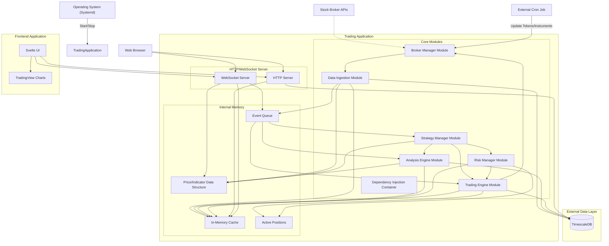

# Technical Architecture Document

## Realtime Analysis and Trading Application

### Document Information

  - **Version**: 1.2
  - **Date**: July 21, 2025
  - **Author**: Technical Architect
  - **Status**: Updated Draft

-----

## Table of Contents

1.  [Executive Summary](https://www.google.com/search?q=%23executive-summary)
2.  [High-Level System Design](https://www.google.com/search?q=%23high-level-system-design)
3.  [Application Lifecycle](https://www.google.com/search?q=%23application-lifecycle)
4.  [Technology Stack](https://www.google.com/search?q=%23technology-stack)
5.  [Component Deep-Dive](https://www.google.com/search?q=%23component-deep-dive)
6.  [Data Model](https://www.google.com/search?q=%23data-model)
7.  [API Design](https://www.google.com/search?q=%23api-design)
8.  [Performance Architecture](https://www.google.com/search?q=%23performance-architecture)
9.  [Security Architecture](https://www.google.com/search?q=%23security-architecture)
10. [Deployment Strategy](https://www.google.com/search?q=%23deployment-strategy)
11. [Monitoring & Observability](https://www.google.com/search?q=%23monitoring--observability)
12. [Operational Modes](https://www.google.com/search?q=%23operational-modes)
13. [Robustness & Fault Tolerance](https://www.google.com/search?q=%23robustness--fault-tolerance)

-----

## Executive Summary

This document defines the technical architecture for a high-performance, real-time analysis and trading application designed for individual intraday traders. The system prioritizes sub-300ms execution latency, supports up to 500 instruments and 30-40 concurrent strategies, and provides comprehensive risk management capabilities. The application is designed for continuous operation on a server, managed by `systemd`, with distinct entry points for live/paper trading and backtesting to ensure operational isolation. External cron jobs handle scheduled tasks like token and instrument updates, removing the need for an internal application scheduler.

### Key Architectural Decisions

  - **Monolithic Architecture**: Monolithic Modular Components with clear separation of concerns, executing as a single application.
  - **Continuous Operation**: Designed for 24/7 runtime on a server, managed by `systemd` with external cron for scheduled tasks.
  - **Event-Driven Processing**: Asynchronous message processing for optimal performance.
  - **In-Memory Computing**: Critical data cached for sub-300ms response times, with specialized data structures for real-time price and indicator values.
  - **Broker-Agnostic Design**: Generic interface supporting multiple broker integrations, with separate classes for broker interaction and data transformation.
  - **Time-Series Optimized Storage**: PostgreSQL with TimescaleDB for efficient data handling.
  - **Dependency Injection**: Utilizing InversifyJS for modularity and testability.
  - **Operational Isolation**: Separate executable entry points for live trading/paper trading and backtesting.

-----

## High-Level System Design



### Core Design Principles

1.  **Performance First**: Every component optimized for the 300ms latency requirement.
2.  **Fault Tolerance**: Graceful degradation, automatic recovery, and defined crash recovery mechanisms.
3.  **Modularity**: Loosely coupled components with clear interfaces, facilitated by Dependency Injection.
4.  **Observability**: Comprehensive logging, metrics, and monitoring.
5.  **Abstraction**: Clear interfaces for external services (e.g., brokers) to minimize impact of changes.

-----

## Application Lifecycle

The application is designed for continuous operation and follows a specific lifecycle from startup to graceful shutdown.

### Startup Flow

1.  **Application Start**: The application executable (e.g., `bun run start:live`) is launched, typically by `systemd` at a scheduled time.
2.  **Instance Initialization & Dependency Injection**: Core services and components are instantiated. `InversifyJS` container is initialized, and instances are bound and resolved, ensuring all dependencies are met.
3.  **Startup Checks**:
      * **Database Connection**: Verify connectivity and schema integrity with PostgreSQL/TimescaleDB.
      * **Broker Connection**: Establish initial connection(s) to the configured broker(s) via the Broker Manager.
4.  **Instrument Processing**:
      * Instruments are filtered and validated based on application-specific criteria.
      * Filtered instruments are sent to the Broker Manager for data subscription, ensuring the broker accepts subscriptions for these instruments.
5.  **Data Collection**: The Data Ingestion Module begins collecting real-time tick data, open interest and order book information from the broker(s).
6.  **Data Aggregation**: Raw data is sent to the Real-time Data Aggregator (within the Analysis Engine).
      * The Aggregator processes raw ticks into various OHLC timeframes (e.g., 1-second, 5-minute).
      * It updates the in-memory `Price/Indicator Data Structure`.
7.  **Strategy Subscription & Execution**:
      * The Real-time Data Aggregator pushes updated OHLC data and indicator values to all subscribed strategies via the Strategy Manager.
      * Strategies analyze the incoming data and, based on their logic, generate trading signals.
      * If a signal warrants a trade, the Strategy requests an order execution from the Trading Engine.
8.  **Order Execution**: The Trading Engine processes the order request, applies risk management rules via the Risk Manager, and sends the order to the Broker Manager for execution with the external broker.
9.  **Order Confirmation & Position Update**: Broker confirms order execution (or rejection). The Trading Engine updates its internal position state, records the order history, and notifies relevant modules.

### Component-Specific Lifecycle Methods

Individual services and modules within the application expose explicit lifecycle methods (e.g., `start()`, `stop()`, `initialize()`, `destroy()`). These methods are called by the main application bootstrap process and the `Dependency Injection Container` to manage their internal resources, establish connections, and perform clean-up operations during graceful shutdown.

### Graceful Shutdown

The application handles standard operating system signals (`SIGINT`, `SIGTERM`) to trigger a graceful shutdown process. This process includes:

  * Calling `stop()`/`destroy()` methods on all active components (e.g., disconnecting from brokers, flushing pending data to DB, saving strategy states).
  * Closing database connections and freeing system resources.
  * Ensuring no open trades are left in an inconsistent state (handled by the Crash Recovery Strategy).

-----

## Technology Stack

### Backend Services

| Component | Technology | Justification |
|-----------|------------|---------------|
| **Runtime** | Bun | Excellent async I/O, built-in tools, TypeScript support, fastest JS runtime |
| **Language** | TypeScript 5.x | Strong typing, compile-time error detection, better maintainability |
| **Framework** | ElysiaJS | High-performance HTTP server, built for Bun, type-safe APIs |
| **WebSocket** | Bun Native WebSocket | Built-in WebSocket support, optimized for performance |
| **Dependency Injection** | InversifyJS | Robust and flexible IoC container for TypeScript, promoting modularity and testability |
| **Caching** | In-Memory Maps/Sets | Ultra-fast access, no network overhead |
| **Message Queue** | Internal Event Emitter | Zero-latency in-process communication |

### Database & Storage

| Component | Technology | Justification |
|-----------|------------|---------------|
| **Primary DB** | PostgreSQL 15+ | ACID compliance, advanced features, reliability |
| **Time-Series** | TimescaleDB 2.x | Optimized for time-series data, automatic partitioning |
| **DB Driver** | Bun's built-in postgres | Native PostgreSQL driver, optimized for Bun runtime |
| **Connection Pool** | Built-in pooling | Native connection management, no external dependencies |
| **Migrations** | Custom Bun scripts | TypeScript-based migrations using Bun's file system APIs |

### Frontend

| Component | Technology | Justification |
|-----------|------------|---------------|
| **Framework** | Svelte 5 with Runes | Compiled output, excellent performance, small bundle size |
| **Charts** | TradingView Lightweight Charts | Industry standard, optimized for financial data |
| **UI Library** | Tailwind CSS | Utility-first, consistent design system |
| **Build Tool** | Vite | Fast development, optimized production builds |
| **State Management** | Svelte $state | Built-in reactivity, simple but powerful |

### Development & Operations

| Component | Technology | Justification |
|-----------|------------|---------------|
| **Containerization** | Docker + Docker Compose | Consistent environments, easy deployment |
| **Process Manager** | Systemd | For managing application startup and continuous running. Bun PM (for dev/local management) |
| **Monitoring** | Prometheus + Grafana | Metrics collection and visualization |
| **Logging** | Bun's console + structured logging | Built-in logging capabilities, no external dependencies |
| **Testing** | Bun Test + Playwright | Native test runner, fast execution, E2E testing |
| **Package Manager** | Bun | Ultra-fast package installation and management |
| **External Scheduler** | OS Cron Jobs | For executing tasks at specific times (e.g., token updates, instrument refreshes) |
| **Version Control** | Git | Standard for collaborative code development and history tracking |

-----

## Component Deep-Dive

### 1\. Data Ingestion Module

**Responsibility**: Collect, normalize, and distribute real-time market data from brokers.

**Key Features**:

  - Multi-broker WebSocket connection management.
  - **Separate Broker Client Interaction Classes**: Dedicated classes (e.g., `ZerodhaClient`, `FyersClient`) implementing an application-defined interface will handle direct communication with broker APIs to retrieve data.
  - **DataTransformer Class**: Converts raw broker-specific data formats into a standardized, application-compliant data format.
  - Data validation and normalization.
  - **Tick Persister**: Batches incoming tick data and efficiently saves it to the `tick_data` table in TimescaleDB.
  - Real-time data distribution via internal event emitters to the Analysis Engine and Strategies.
  - Automatic reconnection and error handling for data feeds.
  - **Abstraction of External Services**: Utilizes clear interfaces for broker interactions to minimize impact of external API changes.

**Performance Optimizations**:

  - Native Bun WebSocket connections for broker APIs.
  - Batch processing for database writes using Bun's async I/O.
  - In-memory buffering using native JavaScript Maps and Sets.
  - Zero-copy data structures for tick data.

<!-- end list -->

```typescript
interface DataIngestionService {
  // Broker connection management
  connectBroker(config: BrokerConfig): Promise<void>;
  disconnectBroker(brokerId: string): Promise<void>;
  
  // Data processing
  processTickData(data: RawBrokerTickData): void; // Raw broker data input
  processOrderBook(data: RawBrokerOrderBookData): void;
  processOrderUpdate(data: RawBrokerData): void;
  processAcknowledgement(data: RawBrokerData): void;
  
  // Health monitoring
  getConnectionStatus(): BrokerStatus[];
  getDataLatency(): LatencyMetrics;
}

// Example DataTransformer interface
interface IDataTransformer {
  transformTick(brokerTick: any): ApplicationTickData;
  transformOrderBook(brokerOrderBook: any): ApplicationOrderBookData;
  transformOrderUpdates(brokerOrderUpdate: any): ApplicationOrderUpdateData;
  transformAcknowledgement(brokerAcknowledgement: any): ApplicationAcknowledgement;
}
```

### 2\. Analysis Engine

**Responsibility**: Process market data, maintain real-time calculated values, and generate trading signals.

**Key Features**:

  - **Real-time Data Aggregator**: Updates a separate, optimized in-memory data structure for current price data (ticks and OHLC candles) and derived technical indicator values. It processes raw ticks into various OHLC timeframes and updates the in-memory Price/Indicator Data Structure.
  - Technical indicator calculations (EMA, RSI, MACD, etc.).
  - Pattern recognition algorithms.
  - Statistical analysis and market summaries.
  - **Open Interest Tracker**: Updates and stores Open Interest (OI) data for relevant instruments.
  - Real-time signal generation.
  - Historical data analysis for backtesting.

**Behavior of Data Structure**: Every time new price data (ticks or candles) is ingested and updated by the Data Ingestion Module, this in-memory data structure will automatically trigger updates to the pre-calculated technical indicator values associated with those instruments and timeframes. This ensures that the analysis engine and strategies can consume consistently updated data without needing to re-calculate indicators on demand.

**Performance Optimizations**:

  - Sliding window algorithms for indicators.
  - Vectorized calculations using optimized libraries.
  - Result caching for frequently accessed data.
  - Parallel processing for multiple instruments (within the single application process).

<!-- end list -->

```typescript
interface AnalysisEngine {
  // Indicator calculations
  calculateEMA(prices: number[], period: number): number[];
  calculateRSI(prices: number[], period: number): number[];
  
  // Pattern recognition
  detectPatterns(candles: OHLC[]): Pattern[];
  
  // Market analysis
  generateMarketSummary(data: MarketData): MarketSummary;
  analyzeSupporResistance(prices: number[]): Level[];
}
```

### 3\. Trading Engine

**Responsibility**: Execute trades and manage positions. Handles both live and paper trading modes.

**Key Features**:

  - Order management (placement, modification, cancellation).
  - Position tracking and management.
  - Risk controls and position sizing.
  - Broker API integration (via Broker Manager).
  - Trade history and audit trail, including detailed order status updates (persisted in `order_history`).
  - **Paper Trading**: In paper trading mode, trades are simulated, based on Last Traded Price (LTP), and stored in the database without interaction with a real broker.

**Performance Optimizations**:

  - In-memory position tracking.
  - Asynchronous order processing.
  - Order queue management.
  - Failover mechanisms for broker connectivity.

<!-- end list -->

```typescript
interface TradingEngine {
  // Order management
  placeOrder(order: OrderRequest): Promise<OrderResponse>;
  cancelOrder(orderId: string): Promise<void>;
  modifyOrder(orderId: string, updates: OrderUpdate): Promise<void>;
  
  // Position management
  getCurrentPositions(): Position[];
  closePosition(instrumentId: string, quantity?: number): Promise<void>;
  
  // Risk controls
  validateOrder(order: OrderRequest): ValidationResult;
  checkRiskLimits(position: Position): RiskCheck;
}
```

### 4\. Strategy Manager

**Responsibility**: Executes trading strategies and manages their lifecycle.

**Key Features**:

  - **Strategy Registration**: Strategies will be registered using decorators (e.g., `@Strategy('MyStrategyName')`), allowing the Strategy Manager to discover and load them at runtime.
  - **Strategy Execution**: Strategies are implemented as normal classes, instantiated and managed by an internal "Strategy Executor." The Executor will handle the lifecycle of strategy instances, providing them with necessary data feeds and interacting with the Trading Engine and Risk Manager.
  - Configuration management for each strategy, including support for custom timeframes, multiple instruments, and configurable parameters.
  - Execution scheduling and monitoring.
  - Backtesting capabilities.
  - Performance tracking.
  - **Dynamic Control**: Provides API endpoints to dynamically enable or disable strategies.

**Performance Optimizations**:

  - Efficient data access patterns to the shared in-memory data structures.
  - Configurable execution intervals.
  - Memory-efficient backtesting engine.

<!-- end list -->

```typescript
interface StrategyManager {
  // Strategy lifecycle
  registerStrategy(strategy: TradingStrategy): void; // Uses decorators for auto-discovery
  enableStrategy(strategyId: string): Promise<void>;
  disableStrategy(strategyId: string): Promise<void>;
  
  // Configuration
  updateStrategyConfig(strategyId: string, config: StrategyConfig): Promise<void>;
  
  // Backtesting
  runBacktest(request: BacktestRequest): Promise<BacktestResult>;
}
```

### 5\. Risk Manager

**Responsibility**: Monitors and controls trading risk across all strategies and the entire portfolio.

**Key Features**:

  - Real-time position monitoring.
  - **Dynamic Position Sizing**: Reduces position size based on adverse price movements or counter-position analysis.
  - **Advanced Stop-Loss Mechanism**:
      * Places Good-Til-Triggered (GTT) orders as primary stop-loss.
      * Actively monitors price action to attempt to close positions at the stop-loss price via market orders *before* the GTT order triggers, to minimize slippage.
      * Implements fallback to immediate market execution if the primary attempt fails or if the market moves rapidly.
      * Ensures all open positions have a mandatory stop-loss.
      * Monitors and cancels GTT orders that are no longer relevant.
  - Portfolio-level risk controls.
  - Emergency position closure.

**Performance Optimizations**:

  - Real-time risk calculations.
  - Efficient position aggregation.
  - Automated risk responses.
  - Concurrent risk monitoring for multiple strategies.

<!-- end list -->

```typescript
interface RiskManager {
  // Risk monitoring
  calculatePortfolioRisk(): RiskMetrics;
  monitorPositionLimits(): void;
  
  // Risk controls
  enforceStopLoss(position: Position): Promise<void>; // Manages GTT and market-based stop-loss
  reducePositionSize(positionId: string, percentage: number): Promise<void>;
  emergencyCloseAll(): Promise<void>;
}
```

### 6\. Broker Manager Module

**Responsibility**: Manages all interactions with external stock broker APIs.

**Key Features**:

  - **Broker-Agnostic Design**: Provides a generic interface to support multiple broker integrations through adapters.
  - **Broker Config Interface**: Defines a common interface for broker configuration. The database stores broker-specific configuration data under a common `config` key (JSONB). Based on the broker type, a specific configuration instance is created and passed to the broker client. This includes credentials to connect to the broker.
  - **Authentication & Instrument Updates**: Authentication token updates and instrument list refreshes are handled by the Broker Client Library and are triggered *externally* by a separate OS cron job, not by an internal application scheduler.
  - Handles broker API rate limits and error recovery for connectivity.
  - Translates internal trading commands into broker-specific API calls.

<!-- end list -->

```typescript
// Example BrokerConfig interface
interface IBrokerConfig {
  apiKey: string;
  apiSecret: string;
  // ... other common config properties
  getCredentials(): any; // Method to get broker-specific credentials
}
```

-----

## Data Model

### TimescaleDB Schema Design

#### 1\. Instruments Table

```sql
CREATE TABLE instruments (
    id SERIAL PRIMARY KEY,
    symbol VARCHAR(50) NOT NULL UNIQUE,
    exchange VARCHAR(20) NOT NULL,
    instrument_type VARCHAR(20) NOT NULL,
    tick_size DECIMAL(10,4),
    lot_size INTEGER,
    expiry_date DATE,
    strike_price DECIMAL(10,2),
    is_active BOOLEAN DEFAULT TRUE,
    created_at TIMESTAMPTZ DEFAULT NOW(),
    updated_at TIMESTAMPTZ DEFAULT NOW()
);

CREATE INDEX idx_instruments_symbol ON instruments(symbol);
CREATE INDEX idx_instruments_active ON instruments(is_active);
```

#### 2\. Tick Data Table (Hypertable)

```sql
CREATE TABLE tick_data (
    time TIMESTAMPTZ NOT NULL,
    instrument_id INTEGER NOT NULL REFERENCES instruments(id),
    price DECIMAL(12,4) NOT NULL,
    quantity INTEGER NOT NULL,
    trade_id VARCHAR(50),
    exchange VARCHAR(20) NOT NULL,
    CONSTRAINT tick_data_pkey PRIMARY KEY (time, instrument_id)
);

-- Convert to hypertable for time-series optimization
SELECT create_hypertable('tick_data', 'time', chunk_time_interval => INTERVAL '1 hour');

-- Create indexes for efficient querying
CREATE INDEX idx_tick_data_instrument_time ON tick_data (instrument_id, time DESC);
CREATE INDEX idx_tick_data_price ON tick_data (price);
```

#### 3\. OHLC Candles Table (Hypertable)

```sql
CREATE TABLE ohlc_candles (
    time TIMESTAMPTZ NOT NULL,
    instrument_id INTEGER NOT NULL REFERENCES instruments(id),
    timeframe VARCHAR(10) NOT NULL, -- '1s', '5s', '1m', '5m', etc.
    open_price DECIMAL(12,4) NOT NULL,
    high_price DECIMAL(12,4) NOT NULL,
    low_price DECIMAL(12,4) NOT NULL,
    close_price DECIMAL(12,4) NOT NULL,
    volume BIGINT NOT NULL,
    trade_count INTEGER,
    vwap DECIMAL(12,4),
    CONSTRAINT ohlc_candles_pkey PRIMARY KEY (time, instrument_id, timeframe)
);

SELECT create_hypertable('ohlc_candles', 'time', chunk_time_interval => INTERVAL '1 day');

CREATE INDEX idx_ohlc_instrument_timeframe ON ohlc_candles (instrument_id, timeframe, time DESC);
```

#### 4\. Order Book Data Table (Hypertable)

```sql
CREATE TABLE order_book_snapshots (
    time TIMESTAMPTZ NOT NULL,
    instrument_id INTEGER NOT NULL REFERENCES instruments(id),
    bid_prices DECIMAL(12,4)[] NOT NULL,
    bid_quantities INTEGER[] NOT NULL,
    ask_prices DECIMAL(12,4)[] NOT NULL,
    ask_quantities INTEGER[] NOT NULL,
    total_bid_quantity BIGINT,
    total_ask_quantity BIGINT,
    CONSTRAINT order_book_pkey PRIMARY KEY (time, instrument_id)
);

SELECT create_hypertable('order_book_snapshots', 'time', chunk_time_interval => INTERVAL '1 hour');
```

#### 5\. Orders Table

```sql
CREATE TABLE orders (
    id UUID PRIMARY KEY DEFAULT gen_random_uuid(),
    strategy_id VARCHAR(100) NOT NULL,
    instrument_id INTEGER NOT NULL REFERENCES instruments(id),
    order_type VARCHAR(20) NOT NULL, -- 'BUY', 'SELL'
    quantity INTEGER NOT NULL,
    price DECIMAL(12,4),
    order_kind VARCHAR(20) NOT NULL, -- 'MARKET', 'LIMIT', 'SL', 'SL-M'
    current_status VARCHAR(20) NOT NULL DEFAULT 'PENDING', -- Current status for quick lookup
    broker_order_id VARCHAR(100),
    filled_quantity INTEGER DEFAULT 0,
    average_price DECIMAL(12,4),
    created_at TIMESTAMPTZ DEFAULT NOW(),
    updated_at TIMESTAMPTZ DEFAULT NOW(),
    executed_at TIMESTAMPTZ,
    cancelled_at TIMESTAMPTZ
);

CREATE INDEX idx_orders_strategy ON orders(strategy_id);
CREATE INDEX idx_orders_current_status ON orders(current_status);
CREATE INDEX idx_orders_created_at ON orders(created_at DESC);
```

#### 6\. Order History Table

```sql
CREATE TABLE order_history (
    id UUID PRIMARY KEY DEFAULT gen_random_uuid(),
    order_id UUID NOT NULL REFERENCES orders(id),
    status VARCHAR(20) NOT NULL, -- e.g., 'PENDING', 'OPEN', 'FILLED', 'CANCELLED', 'REJECTED'
    timestamp TIMESTAMPTZ NOT NULL DEFAULT NOW(),
    details JSONB, -- Optional: Store additional details like reason for rejection
    -- Add indexes for efficient querying
    CREATE INDEX idx_order_history_order_id ON order_history(order_id);
    CREATE INDEX idx_order_history_timestamp ON order_history(timestamp DESC);
);
```

#### 7\. Positions Table

```sql
CREATE TABLE positions (
    id UUID PRIMARY KEY DEFAULT gen_random_uuid(),
    strategy_id VARCHAR(100) NOT NULL,
    instrument_id INTEGER NOT NULL REFERENCES instruments(id),
    quantity INTEGER NOT NULL, -- Positive for long, negative for short
    average_entry_price DECIMAL(12,4) NOT NULL,
    current_price DECIMAL(12,4),
    unrealized_pnl DECIMAL(12,2),
    realized_pnl DECIMAL(12,2) DEFAULT 0,
    stop_loss_price DECIMAL(12,4),
    target_price DECIMAL(12,4),
    status VARCHAR(20) NOT NULL DEFAULT 'OPEN',
    opened_at TIMESTAMPTZ DEFAULT NOW(),
    closed_at TIMESTAMPTZ
);

CREATE INDEX idx_positions_strategy ON positions(strategy_id);
CREATE INDEX idx_positions_status ON positions(status);
CREATE UNIQUE INDEX idx_positions_strategy_instrument ON positions(strategy_id, instrument_id) 
    WHERE status = 'OPEN';
```

#### 8\. Strategies Table

```sql
CREATE TABLE strategies (
    id VARCHAR(100) PRIMARY KEY,
    name VARCHAR(200) NOT NULL,
    description TEXT,
    class_name VARCHAR(100) NOT NULL,
    config JSONB NOT NULL,
    is_enabled BOOLEAN DEFAULT FALSE,
    execution_mode VARCHAR(20) DEFAULT 'PAPER', -- 'LIVE', 'PAPER'
    created_at TIMESTAMPTZ DEFAULT NOW(),
    updated_at TIMESTAMPTZ DEFAULT NOW()
);

CREATE INDEX idx_strategies_enabled ON strategies(is_enabled);
CREATE INDEX idx_strategies_mode ON strategies(execution_mode);
```

#### 9\. Broker Credentials Table

```sql
CREATE TABLE broker_credentials (
    id SERIAL PRIMARY KEY,
    broker_name VARCHAR(50) NOT NULL,
    encrypted_api_key BYTEA NOT NULL,
    encrypted_secret BYTEA NOT NULL,
    encryption_key_id VARCHAR(50) NOT NULL,
    config JSONB NOT NULL DEFAULT '{}'::jsonb, -- Store broker-specific config data
    created_at TIMESTAMPTZ DEFAULT NOW()
);
```

### Data Retention Policies

```sql
-- Tick data retention: 30 days for high-frequency, 1 year for daily aggregates
SELECT add_retention_policy('tick_data', INTERVAL '30 days');

-- OHLC candles retention: 2 years
SELECT add_retention_policy('ohlc_candles', INTERVAL '2 years');

-- Order book snapshots retention: 7 days
SELECT add_retention_policy('order_book_snapshots', INTERVAL '7 days');

-- Order history retention: 5 years
SELECT add_retention_policy('order_history', INTERVAL '5 years');
```

-----

## API Design

### REST API Endpoints

#### Authentication & Authorization

```typescript
POST /api/auth/login
POST /api/auth/logout
GET  /api/auth/profile
```

#### Strategy Management

```typescript
GET    /api/strategies              // List all strategies
GET    /api/strategies/:id          // Get strategy details
POST   /api/strategies/:id/enable   // Enable strategy
POST   /api/strategies/:id/disable  // Disable strategy
PUT    /api/strategies/:id/config   // Update strategy configuration
GET    /api/strategies/:id/performance // Get strategy performance metrics
```

#### Market Data

```typescript
GET /api/instruments                    // List available instruments
GET /api/market-data/:instrument/candles // Get OHLC data for charts and analysis
GET /api/market-data/:instrument/ticks   // Get tick data for detailed analysis
GET /api/market-data/:instrument/depth   // Get order book data for visualization
```

#### Trading

```typescript
GET    /api/orders                  // List orders
POST   /api/orders                  // Place new order
PUT    /api/orders/:id              // Modify order
DELETE /api/orders/:id              // Cancel order
GET    /api/positions               // Get current positions
POST   /api/positions/:id/close     // Close position
```

#### Backtesting

```typescript
POST /api/backtest                  // Start backtest
GET  /api/backtest/:id              // Get backtest status
GET  /api/backtest/:id/results      // Get backtest results
```

#### Risk Management

```typescript
GET /api/risk/portfolio             // Get portfolio risk metrics
GET /api/risk/positions             // Get position risk analysis
POST /api/risk/emergency-stop       // Emergency stop all trading
```

### WebSocket API Events

#### Market Data Streams

```typescript
// Subscribe to real-time tick data
ws.send({
  type: 'subscribe',
  channel: 'ticks',
  instruments: ['NIFTY', 'BANKNIFTY']
});

// Subscribe to order book updates
ws.send({
  type: 'subscribe',
  channel: 'orderbook',
  instruments: ['NIFTY'],
  depth: 5
});
```

#### Trading Updates

```typescript
// Order status updates
{
  type: 'order_update',
  orderId: 'uuid',
  status: 'FILLED',
  filledQuantity: 100,
  averagePrice: 18500.25
}

// Position updates
{
  type: 'position_update',
  positionId: 'uuid',
  unrealizedPnl: -150.50,
  currentPrice: 18495.75
}
```

#### Strategy Monitoring

```typescript
// Strategy performance updates
{
  type: 'strategy_performance',
  strategyId: 'ema_crossover',
  totalPnl: 2500.00,
  todayPnl: 150.00,
  activePositions: 2
}
```

-----

## Performance Architecture

### Sub-300ms Latency Requirements

#### 1\. In-Memory Data Management

  - **Native JavaScript Maps**: Critical market data cached with sub-microsecond access time.
  - **In-Memory Positions**: Active positions stored in optimized data structures.
  - **Bun Connection Pooling**: Pre-established database connections using Bun's native pooling.
  - **Prepared Statements**: Pre-compiled SQL queries for faster execution.
  - **Zero-Copy Buffers**: Efficient memory management for high-frequency data.

#### 2\. Asynchronous Processing Pipeline

```typescript
// High-performance monolithic data processing pipeline
class DataProcessingPipeline {
  private tickBuffer: Map<string, TickData[]> = new Map();
  private priceCache: Map<string, number> = new Map();
  private eventEmitter = new EventTarget();

  async processTick(tick: TickData): Promise<void> {
    // 1. Buffer tick data in native Map (< 0.1ms)
    const instrument = tick.instrumentId;
    const buffer = this.tickBuffer.get(instrument) ?? [];
    buffer.push(tick);
    if (buffer.length > 1000) buffer.shift(); // Keep last 1000 ticks
    this.tickBuffer.set(instrument, buffer);
    
    // 2. Update in-memory price cache (< 0.5ms)
    this.priceCache.set(instrument, tick.price);
    
    // 3. Emit events for immediate processing (< 1ms)
    this.eventEmitter.dispatchEvent(new CustomEvent('tick', {
      detail: tick
    }));
    
    // 4. Check trading signals using cached data (< 5ms)
    const signals = await this.checkTradingSignals(tick);
    
    // 5. Execute trades synchronously for minimal latency (< 20ms)
    for (const signal of signals) {
      await this.executeTrade(signal);
    }
  }

  private async checkTradingSignals(tick: TickData): Promise<TradingSignal[]> {
    // Direct memory access to historical data for sub-ms analysis
    const historicalPrices = this.tickBuffer.get(tick.instrumentId) || [];
    // ... signal processing logic
    return [];
  }
}
```

#### 3\. Database Optimization

  - **TimescaleDB Hypertables**: Automatic partitioning for time-series data.
  - **Strategic Indexing**: Optimized indexes for common query patterns.
  - **Connection Pooling**: Persistent database connections.
  - **Batch Operations**: Bulk inserts for historical data.

#### 4\. Network Optimization

  - **WebSocket Compression**: Reduced payload sizes.
  - **Message Batching**: Multiple updates in single message.
  - **Keep-Alive Connections**: Persistent broker connections.
  - **Local Data Centers**: VPS deployment near broker servers.

### Vertical Scaling Architecture

#### 1\. Single-Application Scaling Strategy

```typescript
// Monolithic application configuration for maximum performance
const applicationConfig = {
  maxInstruments: 500,
  maxConcurrentStrategies: 40,
  dataIngestionRate: 10000, // ticks per second
  memoryAllocation: {
    tickDataBuffer: '2GB',
    analysisCache: '1GB',
    positionsCache: '512MB',
    strategiesMemory: '1GB'
  },
};
```

#### 2\. Memory-Optimized Load Distribution

  - **Instrument Partitioning**: Data structures partitioned by instrument for cache locality.
  - **Strategy Management**: Strategies run within the main application process, managed by the Strategy Manager. Concurrency is handled via Bun's event loop (`async/await`) for I/O-bound operations.
  - **Priority Processing**: Critical orders bypass queue for immediate execution.
  - **Memory Pools**: Pre-allocated object pools to minimize garbage collection.

#### 3\. Resource Management

```typescript
// Single-application resource monitoring
class ResourceManager {
  private memoryUsage = new Map<string, number>();
  private cpuUsage = 0;
  
  async allocateStrategy(strategy: Strategy): Promise<void> {
    const memoryRequired = this.calculateMemoryRequirements(strategy);
    const availableMemory = this.getAvailableMemory();
    
    if (memoryRequired > availableMemory) {
      throw new Error('Insufficient memory for strategy allocation');
    }
  }
  
  async monitorPerformance(): Promise<void> {
    const metrics = await this.collectMetrics();
    if (metrics.latency > 250) {
      await this.optimizeMemoryUsage();
    }
  }
  
  private async optimizeMemoryUsage(): Promise<void> {
    // Run garbage collection and optimize data structures
    Bun.gc();
    this.compactDataBuffers();
  }
}
```

-----

## Security Architecture

### Authentication & Authorization

#### 1\. Multi-Factor Authentication (Recommended)

```typescript
interface AuthenticationService {
  // Primary authentication
  authenticateUser(credentials: UserCredentials): Promise<AuthResult>;
  
  // Optional MFA
  setupTOTP(userId: string): Promise<TOTPSecret>;
  verifyTOTP(userId: string, token: string): Promise<boolean>;
  
  // Session management
  createSession(userId: string): Promise<SessionToken>;
  validateSession(token: string): Promise<SessionInfo>;
}
```

#### 2\. API Security

  - **JWT Tokens**: Stateless authentication with short expiry.
  - **Rate Limiting**: Prevent API abuse and DoS attacks.
  - **Request Validation**: Input sanitization and validation.
  - **CORS Configuration**: Restricted cross-origin requests.

### Data Protection

#### 1\. Encryption at Rest

```sql
-- Encrypted broker credentials
CREATE TABLE broker_credentials (
    id SERIAL PRIMARY KEY,
    broker_name VARCHAR(50) NOT NULL,
    encrypted_api_key BYTEA NOT NULL,
    encrypted_secret BYTEA NOT NULL,
    encryption_key_id VARCHAR(50) NOT NULL,
    config JSONB NOT NULL DEFAULT '{}'::jsonb, -- Store broker-specific config data
    created_at TIMESTAMPTZ DEFAULT NOW()
);
```

All sensitive data, including broker credentials, is stored encrypted at rest in the database. The `SecretsManager` handles runtime decryption.

#### 2\. Encryption in Transit

  - **TLS 1.3**: All HTTP/WebSocket communications.
  - **Certificate Pinning**: Prevent man-in-the-middle attacks.
  - **Secure Headers**: HSTS, CSP, and other security headers.

#### 3\. Secrets Management

```typescript
// Environment-based configuration
class SecretsManager {
  private encryptionKey: string;
  
  async encryptCredential(credential: string): Promise<string> {
    return await encrypt(credential, this.encryptionKey);
  }
  
  async decryptCredential(encryptedCredential: string): Promise<string> {
    return await decrypt(encryptedCredential, this.encryptionKey);
  }
}
```

-----

## Deployment Strategy

### VPS Infrastructure Requirements

#### 1\. Server Specifications

```yaml
# Minimum VPS Requirements
cpu: 4 vCPUs (2.4GHz+)
memory: 16GB RAM
storage: 200GB SSD (NVMe preferred)
network: 1Gbps connection
location: Near broker data centers
operating_system: Ubuntu 22.04 LTS
```

#### 2\. Docker Configuration

```dockerfile
# Optimized Bun-based container
FROM oven/bun:1 AS base
WORKDIR /app

# Install dependencies
COPY package.json bun.lockb ./
RUN bun install --frozen-lockfile --production

# Copy source code
COPY . .

# Build the application
RUN bun run build

# Create production user
RUN addgroup -g 1001 -S bunuser
RUN adduser -S bunuser -u 1001

# Set ownership and switch to non-root user
RUN chown -R bunuser:bunuser /app
USER bunuser

# Expose ports for HTTP and WebSocket
EXPOSE 3000

# Start the monolithic application
# CMD ["bun", "run", "start"] - Replaced by specific entry points for operational isolation
```

#### 3\. Docker Compose Architecture

```yaml
version: '3.8'
services:
  # Trading Application - Live/Paper Trading Mode
  trading-app-live:
    build: .
    ports:
      - "3000:3000"  # HTTP and WebSocket on same port
    environment:
      - NODE_ENV=production
      - DATABASE_URL=${DATABASE_URL}
      - BUN_ENV=production
      - APP_MODE=live_trading # New env var for operational mode
    depends_on:
      - postgres
    restart: unless-stopped
    volumes:
      - ./logs:/app/logs
    healthcheck:
      test: ["CMD", "curl", "-f", "http://localhost:3000/health"]
      interval: 30s
      timeout: 10s
      retries: 3
    command: bun run start:live # Specific entry point for live/paper trading

  # Trading Application - Backtesting Mode (optional, can be run on demand)
  # This service can be started separately when backtesting is needed
  trading-app-backtest:
    build: .
    environment:
      - NODE_ENV=production
      - DATABASE_URL=${DATABASE_URL}
      - BUN_ENV=production
      - APP_MODE=backtesting # New env var for operational mode
    depends_on:
      - postgres
    # No exposed ports if backtesting is purely CLI/batch driven
    # volumes:
    #   - ./backtest_results:/app/backtest_results
    restart: "no" # Backtesting is typically a one-off task
    command: bun run start:backtest # Specific entry point for backtesting
    
  # Database Service
  postgres:
    image: timescale/timescaledb:latest-pg15
    ports:
      - "5432:5432"
    environment:
      - POSTGRES_DB=${POSTGRES_DB}
      - POSTGRES_USER=${POSTGRES_USER}
      - POSTGRES_PASSWORD=${POSTGRES_PASSWORD}
    volumes:
      - postgres_data:/var/lib/postgresql/data
      - ./scripts/init.sql:/docker-entrypoint-initdb.d/init.sql
    restart: unless-stopped
    command: postgres -c shared_preload_libraries=timescaledb -c max_connections=200
    
  # Frontend Application
  web-app:
    build: ./frontend
    ports:
      - "80:80"
    environment:
      - API_URL=http://localhost:3000
      - WS_URL=ws://localhost:3000
    depends_on:
      - trading-app-live # Frontend depends on the live trading app's web server
    restart: unless-stopped
    
  # Monitoring Services
  prometheus:
    image: prom/prometheus:latest
    ports:
      - "9090:9090"
    volumes:
      - ./monitoring/prometheus.yml:/etc/prometheus/prometheus.yml
      - prometheus_data:/prometheus
    restart: unless-stopped
    
  grafana:
    image: grafana/grafana:latest
    ports:
      - "3001:3000"
    environment:
      - GF_SECURITY_ADMIN_PASSWORD=${GRAFANA_PASSWORD}
    volumes:
      - grafana_data:/var/lib/grafana
      - ./monitoring/dashboards:/etc/grafana/provisioning/dashboards
    depends_on:
      - prometheus
    restart: unless-stopped

volumes:
  postgres_data:
  prometheus_data:
  grafana_data:
```

### External Cron Jobs (for scheduled tasks)

Separately from the application, OS-level cron jobs will be configured to execute specific tasks. This removes the need for an internal application scheduler.

Example cron script `update_broker_data.sh`:

```bash
#!/bin/bash
# Script to update broker tokens and instruments

# Get current directory of the script
SCRIPT_DIR="$( cd "$( dirname "${BASH_SOURCE[0]}" )" &> /dev/null && pwd )"
APP_DIR="/opt/trading-app" # Path to your deployed application directory

# Change to application directory to access node_modules and Bun
cd "$APP_DIR" || exit

# --- Update Broker Tokens ---
echo "Updating broker tokens..."
# Execute a Bun script that interacts with the Broker Manager's authentication method
bun run scripts/updateTokens.ts || { echo "Failed to update tokens."; exit 1; }

# --- Update Instruments ---
echo "Updating instrument list..."
# Execute a Bun script that interacts with the Broker Manager's instrument refresh method
bun run scripts/refreshInstruments.ts || { echo "Failed to refresh instruments."; exit 1; }

echo "Broker data update complete."
```

Example cron entry (e.g., in `/etc/cron.d/trading_app_tasks`):

```cron
# Run every day at 1 AM
0 1 * * * root /usr/local/bin/update_broker_data.sh >> /var/log/trading_app_cron.log 2>&1
```

### Application Management with Systemd

The `trading-app-live` service will be managed by `systemd` to ensure it starts automatically on boot and restarts if it crashes.

Example `systemd` service file (`/etc/systemd/system/trading-app-live.service`):

```ini
[Unit]
Description=Trading Application Live Service
After=network.target postgres.service # Ensure network and database are up

[Service]
ExecStart=/usr/bin/docker-compose -f /opt/trading-app/docker-compose.yml up trading-app-live # Start only the live trading service
WorkingDirectory=/opt/trading-app
Restart=always
User=your_linux_user # User to run the docker-compose command
Group=your_linux_group # Group to run the docker-compose command
StandardOutput=journal
StandardError=journal

[Install]
WantedBy=multi-user.target
```

### Backup & Recovery Strategy

#### 1\. Database Backups

```bash
#!/bin/bash
# Daily database backup script
BACKUP_DIR="/opt/backups/postgres"
DATE=$(date +%Y%m%d_%H%M%S)

# Create backup
pg_dump -h localhost -U trading_user trading_db | gzip > "$BACKUP_DIR/backup_$DATE.sql.gz"

# Keep only last 7 days
find $BACKUP_DIR -name "backup_*.sql.gz" -mtime +7 -delete
```

#### 2\. Application State Backup

```bash
#!/bin/bash
# Backup application configuration and logs
BACKUP_DIR="/opt/backups"
DATE=$(date +%Y%m%d_%H%M%S)

# Backup configuration files
tar -czf "$BACKUP_DIR/config/config_$DATE.tar.gz" \
  /opt/trading-app/.env \
  /opt/trading-app/config/ \
  /opt/trading-app/docker-compose.yml

# Backup application logs
tar -czf "$BACKUP_DIR/logs/logs_$DATE.tar.gz" \
  /opt/trading-app/logs/

# Backup any persistent application state (if needed)
tar -czf "$BACKUP_DIR/app-state/state_$DATE.tar.gz" \
  /opt/trading-app/data/ 2>/dev/null || true

# Keep only last 14 days of backups
find $BACKUP_DIR -name "*.tar.gz" -mtime +14 -delete
```

-----

## Monitoring & Observability

### System Metrics

#### 1\. Performance Metrics

```typescript
// Key performance indicators
interface PerformanceMetrics {
  // Latency metrics
  avgOrderExecutionTime: number;     // Target: < 300ms
  avgDataProcessingTime: number;     // Target: < 50ms
  avgAPIResponseTime: number;        // Target: < 100ms
  
  // Throughput metrics
  ordersPerSecond: number;
  ticksPerSecond: number;
  activeStrategies: number;
  
  // System metrics
  cpuUsage: number;
  memoryUsage: number;
  diskUsage: number;
  networkLatency: number;
}
```

#### 2\. Business Metrics

```typescript
interface BusinessMetrics {
  // Trading metrics
  totalPnL: number;
  winRate: number;
  sharpeRatio: number;
  maxDrawdown: number;
  
  // Strategy metrics
  strategiesActive: number;
  strategiesEnabled: number;
  strategiesInError: number;
  
  // Risk metrics
  portfolioValue: number;
  totalExposure: number;
  riskAdjustedReturns: number;
}
```

#### 3\. Prometheus Configuration

```yaml
# prometheus.yml
global:
  scrape_interval: 15s
  evaluation_interval: 15s

rule_files:
  - "trading_alerts.yml"

scrape_configs:
  - job_name: 'trading-api'
    static_configs:
      - targets: ['trading-app-live:3000'] # Target the live trading app
    metrics_path: '/metrics'
    scrape_interval: 5s
    
  - job_name: 'trading-websocket'
    static_configs:
      - targets: ['trading-app-live:3000'] # WebSocket and HTTP on same port
    metrics_path: '/metrics'
    scrape_interval: 5s
    
  - job_name: 'postgresql'
    static_configs:
      - targets: ['postgres-exporter:9187']
    
  - job_name: 'redis'
    static_configs:
      - targets: ['redis-exporter:9121'] # If Redis is introduced later

alerting:
  alertmanagers:
    - static_configs:
        - targets:
          - alertmanager:9093
```

#### 4\. Critical Alerts Configuration

```yaml
# trading_alerts.yml
groups:
  - name: trading_critical
    rules:
      - alert: HighLatency
        expr: avg_order_execution_time > 300
        for: 30s
        labels:
          severity: critical
        annotations:
          summary: "Order execution latency exceeded 300ms"
          
      - alert: DataFeedDown
        expr: up{job="data-ingestion"} == 0
        for: 10s
        labels:
          severity: critical
        annotations:
          summary: "Data ingestion service is down"
          
      - alert: HighRisk
        expr: portfolio_risk_ratio > 0.8
        for: 0s
        labels:
          severity: warning
        annotations:
          summary: "Portfolio risk ratio exceeds 80%"
          
      - alert: StrategyError
        expr: strategy_error_count > 5
        for: 1m
        labels:
          severity: warning
        annotations:
          summary: "Multiple strategy execution errors detected"
```

### Logging Strategy

#### 1\. Structured Logging

```typescript
// Centralized logging configuration
import winston from 'winston';

const logger = winston.createLogger({
  level: 'info',
  format: winston.format.combine(
    winston.format.timestamp(),
    winston.format.errors({ stack: true }),
    winston.format.json()
  ),
  defaultMeta: { service: 'trading-app' },
  transports: [
    new winston.transports.File({ 
      filename: 'logs/error.log', 
      level: 'error' 
    }),
    new winston.transports.File({ 
      filename: 'logs/combined.log' 
    }),
    new winston.transports.Console({
      format: winston.format.simple()
    })
  ]
});

// Trading-specific log events
logger.info('Order placed', {
  orderId: 'uuid',
  instrument: 'NIFTY',
  quantity: 100,
  price: 18500,
  strategy: 'ema_crossover',
  executionTime: 245
});
```

#### 2\. ELK Stack Integration

```yaml
# docker-compose.logging.yml
version: '3.8'
services:
  elasticsearch:
    image: docker.elastic.co/elasticsearch/elasticsearch:8.6.0
    environment:
      - discovery.type=single-node
      - "ES_JAVA_OPTS=-Xms512m -Xmx512m"
    ports:
      - "9200:9200"
    volumes:
      - elasticsearch_data:/usr/share/elasticsearch/data
      
  logstash:
    image: docker.elastic.co/logstash/logstash:8.6.0
    volumes:
      - ./config/logstash.conf:/usr/share/logstash/pipeline/logstash.conf
    ports:
      - "5044:5044"
    depends_on:
      - elasticsearch
      
  kibana:
    image: docker.elastic.co/kibana/kibana:8.6.0
    environment:
      - ELASTICSEARCH_HOSTS=http://elasticsearch:9200
    ports:
      - "5601:5601"
    depends_on:
      - elasticsearch

volumes:
  elasticsearch_data:
```

-----

## Operational Modes

This section explicitly defines the different operational modes of the application, enabled by separate executable entry points. This ensures clear operational boundaries and optimized resource management for each use case.

### 1\. Live/Paper Trading Mode

This mode is designed for continuous, real-time operation.

  * **Entry Point**: `bun run start:live` (or similar command).
  * **Active Components**: All core modules are active: Data Ingestion, Analysis Engine, Trading Engine (configured for live or paper), Strategy Manager, Risk Manager, Broker Manager, and the HTTP/WebSocket Server.
  * **Purpose**: To execute strategies against live market data (either real or simulated for paper trading), manage positions, and provide real-time UI updates.
  * **Characteristics**: Long-running process, requires continuous broker connectivity, active risk management.

### 2\. Backtesting Mode

This mode is designed for historical simulation and strategy optimization.

  * **Entry Point**: `bun run start:backtest` (or similar command).
  * **Active Components**: Primarily the historical data loader, Analysis Engine, Strategy Manager, and a simulated Trading Engine/Risk Manager (which interacts with historical data instead of live broker APIs). The HTTP/WebSocket server may or may not be active depending on how backtest results are retrieved (e.g., CLI output vs. dedicated API for UI).
  * **Purpose**: To run strategies against historical data to evaluate performance, identify optimal parameters, and validate strategy logic without real-time market pressure or broker interaction.
  * **Characteristics**: Typically a batch process, can be resource-intensive depending on the historical data range, does not require continuous broker connectivity.

-----

## Robustness & Fault Tolerance

This section details mechanisms implemented to ensure the application's stability and ability to recover from failures, meeting the requirements for robustness and fault tolerance.

### 1\. WebSocket Liveness Checks & Auto-Reconnection

  * **Liveness Checks**: Implement regular heartbeat mechanisms or ping-pong frames over WebSocket connections to broker data feeds. If a response is not received within a defined timeout, the connection is considered stale.
  * **Auto-Reconnection**: Upon detecting a disconnected or stale WebSocket, the system will automatically attempt to re-establish the connection. This includes:
      * Exponential backoff strategy for retries to avoid overwhelming broker APIs.
      * Logging of connection attempts and failures for monitoring.
      * Prioritization of critical data feeds.

### 2\. Crash Recovery Strategy for Trading Positions

In the event of an unexpected application crash or restart, a defined recovery process ensures minimal impact on trading operations and data integrity:

  * **Persistent Position State**: All open trading positions are persistently stored in the `positions` table in TimescaleDB. This includes `strategy_id`, `instrument_id`, `quantity`, `average_entry_price`, `stop_loss_price`, and `status`.
  * **Startup Reconciliation**:
      * On application restart, the **Trading Engine** and **Risk Manager** will query the database to retrieve all `OPEN` positions associated with currently enabled strategies.
      * For each re-loaded position, the system will:
          * Re-establish internal monitoring (e.g., stop-loss triggers).
          * Reconcile the internal position state with the actual position held at the broker (via Broker Manager API calls). This step is crucial to detect any discrepancies that might have occurred during the crash.
          * Re-subscribe to relevant market data streams for these instruments to ensure real-time updates for continued monitoring and execution.
  * **Order Reconciliation**: Pending orders (if any) at the time of crash will also be queried from the database and their status verified with the broker to prevent duplicate orders or missed fills.

-----

## Conclusion

This technical architecture document provides a comprehensive foundation for building a high-performance, scalable, and reliable real-time trading application. The proposed monolithic architecture, enhanced with explicit provisions for continuous operation via `systemd` and external cron jobs, InversifyJS for dependency injection, decorator-based strategy registration, and robust fault tolerance mechanisms, addresses all critical requirements including:

  - **Sub-300ms execution latency** through Bun's optimized runtime, in-memory data structures, and zero-copy processing.
  - **Support for 500+ instruments and 30-40 concurrent strategies** via efficient memory management and an executor-based strategy model.
  - **Robust risk management** with real-time monitoring and automated controls in a single application context.
  - **Broker-agnostic design** enabling integration with multiple trading platforms through modular broker adapters and clear interfaces, supported by dedicated interaction and data transformation classes.
  - **Comprehensive monitoring and observability** for production operations with minimal overhead.
  - **Simplified deployment** with a single application container, now with separate entry points for operational isolation, reducing complexity and increasing control.
  - **Maximum performance** through elimination of network overhead within the core logic.
  - **Enhanced Reliability** through detailed crash recovery, WebSocket connection management, and graceful shutdown mechanisms.

### Next Steps

1.  **Phase 1**: Implement core data ingestion and storage components.
2.  **Phase 2**: Develop analysis engine and basic strategy framework (integrating InversifyJS and decorators).
3.  **Phase 3**: Build trading engine with enhanced risk management and paper trading capabilities.
4.  **Phase 4**: Create web UI and real-time monitoring.
5.  **Phase 5**: Implement backtesting and optimization tools.

The architecture is designed to be implemented incrementally, allowing for early testing and validation while building toward the full feature set outlined in the PRD.